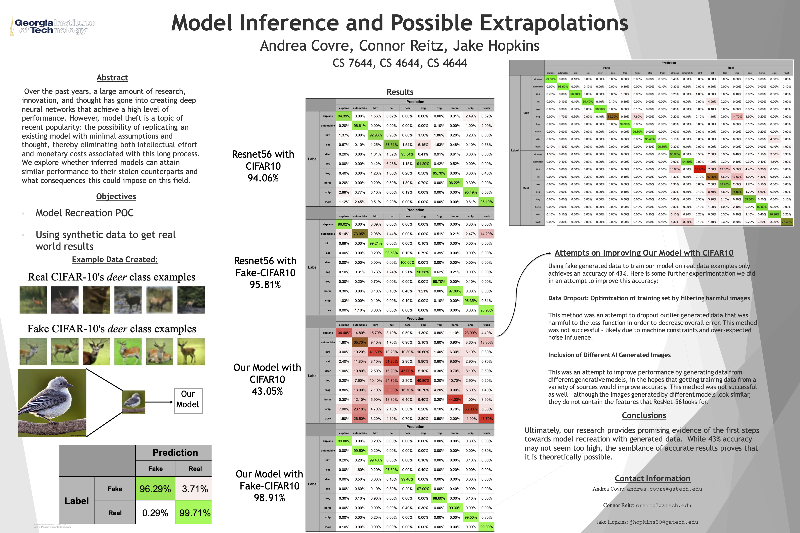

# Deep Learning Model Inference

## Goal

Through this project, we investigate whether Generative Deep Learning Models (such as DALL-E Mini) can generate data that is suitable to effectively train a secondary DL Classification Model with an accuracy comparable to classification models trained on real data, such as the CIFAR-10 dataset.

## Research Paper

## Research Poster

## Contributors
Andrea Covre - [andrea.covre@gatech.edu](mailto:andrea.covre@gatech.edu)
 
Jake Hopkins - [jhopkins39@gatech.edu](mailto:jhopkins39@gatech.edu)
 
Connor Reitz - [creitz@gatech.edu](mailto:creitz@gatech.edu)